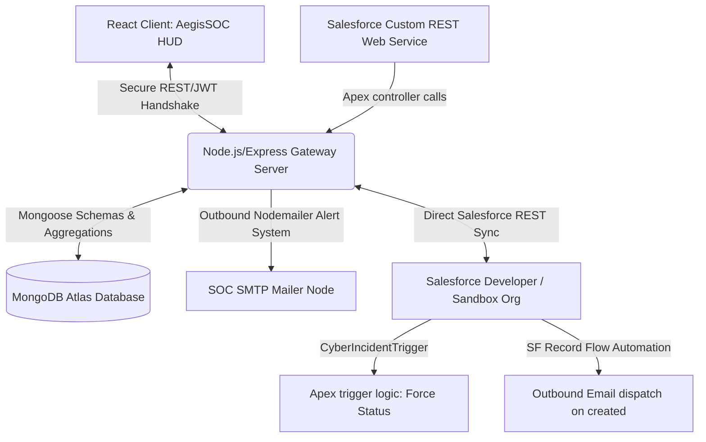

# AegisSentinel: Advanced Cyber Security Incident Management SOC & Salesforce Platform

AegisSentinel is an enterprise-grade, full-stack Security Operations Center (SOC) incident response and threat intelligence platform. Featuring a futuristic, modern React interface styled with glassmorphic cyberpunk widgets, and supported by a Node.js/Express REST API layer connected to a MongoDB backend, it coordinates real-time bidirectionals Salesforce custom object synchronizations.

---

## 🌌 System Architecture Blueprint



---

## 🛠️ Technology Integration Stack

* **Frontend HUD:** React, Vite, Tailwind CSS (Custom Cyber Glow properties), Framer Motion animations, Recharts, and Lucide React Icons.
* **Backend Gateway:** Node.js, Express, JWT, Bcrypt, Mongoose, and Nodemailer.
* **Database Layer:** MongoDB Atlas (Persistent collections with auto-seeding sample records).
* **CRM Platform Integration:** Salesforce REST API, OAuth 2.0 Web Server credentials, Connected Apps, custom object schemas, Apex triggers, Apex REST classes, and record flows.

---

## 📂 Project Directory Structure

```text
/Users/akshaypratappandey/slaesforce/
├── package.json               # Root manager coordinating concurrent dev scripts
├── .env.example               # Environmental configuration blueprint
├── backend/                   # Node.js REST API server logic
│   ├── package.json
│   ├── server.js              # Express entrypoint & database connection
│   ├── controllers/           # Auth, incident, threat logs, analyst controllers
│   ├── models/                # MongoDB/Mongoose Schemas (User, Incident, Threat, Analyst)
│   ├── middleware/            # JWT and Role-Based Access Control filters
│   └── services/              # Nodemailer alert relays & Salesforce REST Sync client
├── frontend/                  # React Vite client interface
│   ├── package.json
│   ├── vite.config.js
│   ├── tailwind.config.js     # Cyber neon theme properties configuration
│   ├── postcss.config.js
│   ├── index.html             # Sci-Fi theme font imports
│   └── src/
│       ├── main.jsx
│       ├── App.jsx            # Protected routes manager
│       ├── index.css          # Futuristic glows & glassmorphic layouts
│       ├── components/        # Sidebar layouts, modals, HUD widgets
│       └── pages/             # Dashboard, Incidents, Threats, Leaderboards, Settings
├── salesforce/                # Salesforce DX (SFDX) code metadata
│   ├── sfdx-project.json
│   └── force-app/main/default/
│       ├── classes/           # IncidentController.cls REST CRUD web service
│       ├── triggers/          # CyberIncidentTrigger.trigger priority rules
│       ├── flows/             # Record-triggered flow email dispatchers
│       └── objects/           # Custom object schema metadata rules
└── docs/                      # Manual reference guides
    ├── API_Documentation.md
    └── Salesforce_Deployment_Guide.md
```

---

## 🚀 Speed-Run Local Execution Blueprint

Establish staging operations locally in less than 5 minutes:

### 1. Environmental Configurations
Clone the environmental blueprint:
```bash
cp .env.example .env
```
*(By default, `SF_INTEGRATION_MODE` is set to `SIMULATED`. This launches a realistic Salesforce OAuth token cache and REST payload visual log simulator in your terminal, letting you execute all features locally without registering Salesforce dev environments!)*

### 2. Dependency Installations
Run the root seeder script to download all frontend, backend, and concurrently execution modules:
```bash
npm run install:all
```

### 3. Launch Development Handshake
Launch both the Express backend server (`localhost:5001`) and the Vite React server (`localhost:3000`) concurrently in single terminal:
```bash
npm run dev
```

### 4. Evaluation Credentials
Upon loading `http://localhost:3000`, authenticate using any of our auto-seeded developer credentials:
* **Administrator Core (Full CRUD & Salesforce diagnostics sync):**
  * Email: `admin@aegis.com`
  * Password: `password123`
* **Analyst Team Member (Standard investigations):**
  * Email: `anjali@aegis.com`
  * Password: `password123`

---

## 🚨 Salesforce Custom Automations Specs

1. **Apex Trigger (`CyberIncidentTrigger`):** Enforces high-priority controls. If a record's `Priority__c` is updated/set to `High`, it automatically overrides and initializes `Status__c` to `New`, triggering terminal alerts and logs.
2. **Apex REST Web Service (`IncidentController`):** Exposes `GET`, `POST`, `PUT`, and `DELETE` endpoints under path `/services/apexrest/CyberIncidents/*` enabling bidirectional CRM sync operations.
3. **Record Flow Automation:** Auto-dispatches HTML briefs to security operations queues whenever a new custom incident record is filed in Salesforce.

---

## 📂 Reference Manuals

* Detailed routing models and REST structures: Refer to [API_Documentation.md](file:///Users/akshaypratappandey/slaesforce/docs/API_Documentation.md).
* CLI configurations, digital signatures, and Named Credentials setup: Refer to [Salesforce_Deployment_Guide.md](file:///Users/akshaypratappandey/slaesforce/docs/Salesforce_Deployment_Guide.md).
